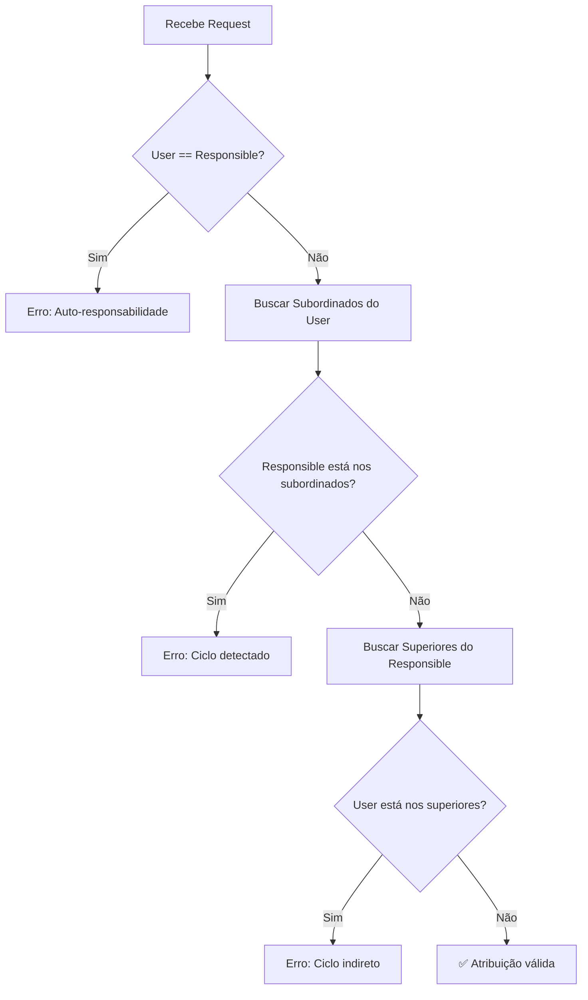
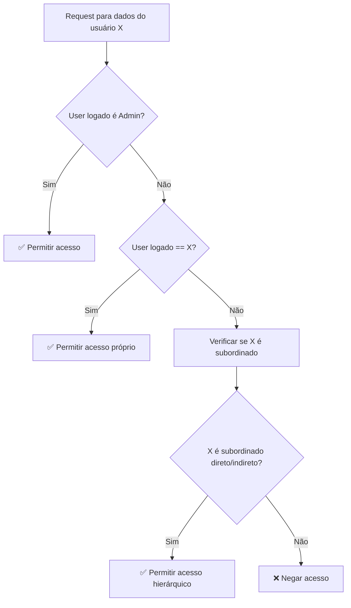

# 🏗️ Sistema de Hierarquia Organizacional

## 📋 Visão Geral

O sistema implementa uma hierarquia organizacional baseada no campo `ResponsibleId` do modelo `User`. Isso cria uma árvore de responsabilidades onde:

- **Cada usuário pode ter um responsável** (superior hierárquico)
- **Cada usuário pode ser responsável por outros** (subordinados)
- **A hierarquia define permissões de acesso** aos dados

## 🔐 Regras de Negócio

### 1. **Estrutura Hierárquica**
```
CEO (ResponsibleId: null)
├── Diretor (ResponsibleId: CEO)
│   ├── Gerente A (ResponsibleId: Diretor)
│   │   ├── Funcionário 1 (ResponsibleId: Gerente A)
│   │   └── Funcionário 2 (ResponsibleId: Gerente A)
│   └── Gerente B (ResponsibleId: Diretor)
│       └── Funcionário 3 (ResponsibleId: Gerente B)
```

### 2. **Permissões de Acesso**

| Papel | Pode Acessar |
|-------|--------------|
| **Admin** | Todos os usuários e dados |
| **Responsável** | Dados de todos os subordinados (diretos e indiretos) |
| **Usuário** | Apenas seus próprios dados |

### 3. **Validações Obrigatórias**

#### ❌ **Prevenção de Ciclos**
- Um usuário não pode ser responsável por si mesmo
- Um subordinado não pode se tornar responsável de seu superior
- Validação em cascata para evitar ciclos indiretos

#### ✅ **Exemplos Válidos**
```json
// ✅ Atribuição normal
{
  "userId": "funcionario-id",
  "responsibleId": "gerente-id"
}

// ✅ Remover responsabilidade (usuário independente)
{
  "userId": "funcionario-id",
  "responsibleId": null
}
```

#### ❌ **Exemplos Inválidos**
```json
// ❌ Auto-responsabilidade
{
  "userId": "user-123",
  "responsibleId": "user-123"
}

// ❌ Ciclo direto (se A é responsável por B)
{
  "userId": "user-A",
  "responsibleId": "user-B"
}
```

## 🛠️ Endpoints Implementados

### **Gerenciamento de Hierarquia**

| Método | Endpoint | Descrição | Permissão |
|--------|----------|-----------|-----------|
| `POST` | `/api/hierarchy/assign-responsibility` | Define responsabilidade | Admin |
| `DELETE` | `/api/hierarchy/remove-responsibility/{userId}` | Remove responsabilidade | Admin |
| `GET` | `/api/hierarchy/tree` | Árvore hierárquica completa | Usuário |
| `GET` | `/api/hierarchy/subordinates/{userId}` | Lista subordinados | Manager+ |
| `GET` | `/api/hierarchy/superiors/{userId}` | Cadeia de superiores | Usuário |

### **Controle de Acesso nos Controllers Existentes**

#### **ManagerController** - Filtrado por Hierarquia
- `/api/manager/dashboard` - Apenas dados dos subordinados
- `/api/manager/team` - Apenas subordinados diretos
- `/api/manager/courses-status?employeeId=X` - Validação se employeeId é subordinado
- `/api/manager/employee/{id}/dashboard` - Validação de subordinação

#### **UsersController** - Controle Administrativo
- Criação/edição mantém regras de hierarquia
- Admins podem gerenciar todos
- Managers podem ver subordinados

## 🔄 Fluxo de Validação

### **1. Atribuição de Responsabilidade**


### **2. Verificação de Acesso**


## 📋 Casos de Uso

### **Cenário 1: Manager visualizando equipe**
1. Manager acessa `/api/manager/team`
2. Sistema identifica manager pelo JWT
3. Busca todos os subordinados diretos
4. Retorna apenas dados da equipe subordinada

### **Cenário 2: Definindo nova hierarquia**
1. Admin acessa `/api/hierarchy/assign-responsibility`
2. Sistema valida se não há ciclos
3. Atualiza `ResponsibleId` do usuário
4. Hierarquia é imediatamente efetiva

### **Cenário 3: Manager tentando acessar dados fora da hierarquia**
1. Manager tenta `/api/manager/courses-status?employeeId=X`
2. Sistema verifica se X é subordinado do manager
3. Se não for, retorna `403 Forbidden`
4. Se for, retorna dados normalmente

## 🧪 Testes no Postman

A collection inclui exemplos para testar:

1. **Criar hierarquia válida**
2. **Tentar criar ciclo** (deve falhar)
3. **Manager acessando subordinado** (deve funcionar)
4. **Manager acessando não-subordinado** (deve falhar)
5. **Visualizar árvore hierárquica**

## ⚠️ Considerações Importantes

1. **Performance**: Validações de hierarquia podem ser custosas - considere cache
2. **Transações**: Mudanças de hierarquia devem ser atômicas
3. **Auditoria**: Todas as mudanças de hierarquia devem ser logadas
4. **Migração**: Dados existentes podem precisar ajuste na hierarquia

## 🚀 Próximos Passos

1. **Implementar handlers reais** (substituindo mocks)
2. **Adicionar cache** para consultas de hierarquia
3. **Implementar notificações** de mudanças hierárquicas
4. **Criar testes automatizados** para validação de ciclos
